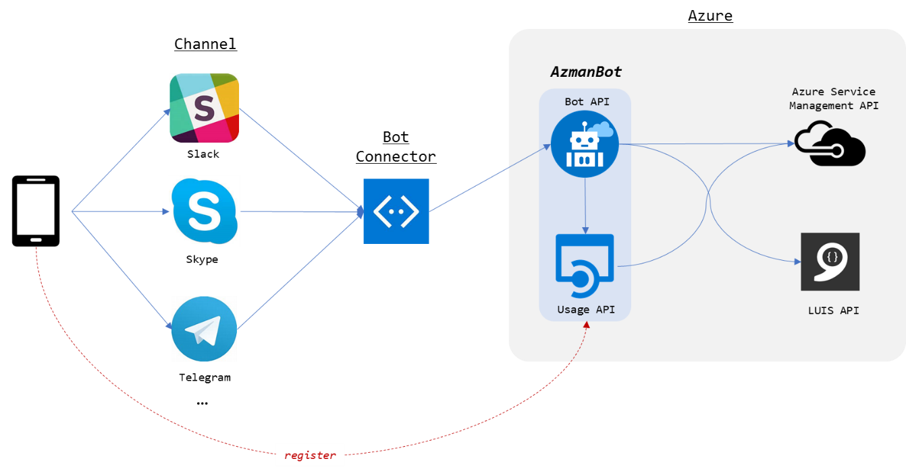

# Azure Management Bot (AzmanBot)

## Overview

This sample demonstrates to show how to build chat bot app that manages azure backend, such as stop/start VMs.
This chat bot simplifies some azure management without login to Azure Portal. It also has scheduling feature to stop/start VMs.
In addition to Azure management, chat bot understands natural language by integrating with [LUIS](https://www.luis.ai).

**CAUTION**: This sample requires to store azure subscription information in host api app, including secret key. It is recommended to use for private bot service.

## APIs

Azmanbot is a sample chatbot using botframework from Microsoft. This bot service consists of two api services, i.e., Bot API and Usage API.

Bot API does not support natural language chat and it only supports CLI (Command Line Interface) like chatting. If you want to support natural language you can use Bot API with LUIS instead.

### Bot API

Basic chatbot api. It understands only CLI style chat. e.g., You can set azure vm to start every week at 8:55 am (as of executing day) by `sch start azurevm 8:55am week`

_note: For entering the time, you have to enter am or pm with no space. i.e., `8:55am` is okay but `8:55 am` is NOT okay_

[botapi cli/master branch](./tree/cli/botapi)

_Click to see demo_

### Bot API (LUIS)

Chatbot api with [LUIS](https://www.luis.ai). It understands natural language chat. e.g., You can set azure vm to start every monday at 8:55 am by `set schedule to start (azurevm) at 8:55 am on every monday`

_note: LUIS version of chatbot understands various way of time and date._

[botapi luis branch](./tree/luis/botapi)

_Click to see demo_

### Usage API

Azure subscription billing usage api. It is written in C#/.NET core. because it can handle complex data query by built-in LINQ feature.

[usageapi](./usageapi)

## Architecture

## Features

* Bot framework with Skype & Slack

    * Basic/Prompt/Waterfall conversation

    * Server initiate chat

    * CLI style chat

* Azure service management (list, status, stop/start, usage)

    * Get Access token using OAuth client credential (require AAD configuration)

    * Call Azure Service Management API

    * Call Azure Billing API (separate api app)

    * Filter and calculate usage using LINQ

* Scheduling (sch)

    * start/stop VM on schedule time

    * set daily or weekly repeat scheduling

* Multi-user support (register)

    * self-registration

    * Stateful user info (subscription and etc.)

* Server message (/api/message/:userid)

    * send a message to user from backend 

* _Natural language support by LUIS_

